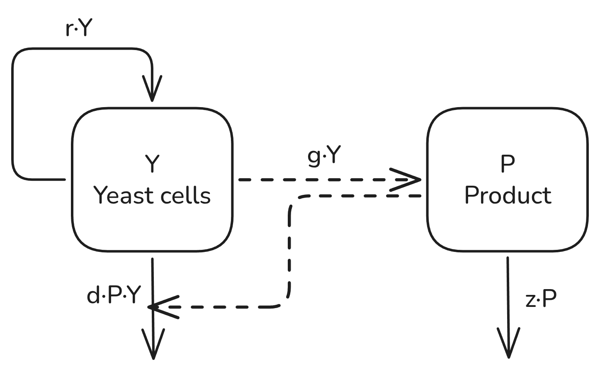

# toxic-yeast-production
This project analyzes the mathematical model of yeast cells that grow linearly but die by their produced product. Equilibria and stability conditions are computed to gain insights about growth/regulation of the yeast cells.

Watch a simulation of the model with custom parameters in the [shiny app](https://lai-es-toxic-yeast-production.share.connect.posit.cloud/).

## AI-usage

See the [AI-declaration](ai usage/AI_usage.pdf) for a comprehensive list where AI was used in this project

0 < g <= 1 | g = probability that each cell produces a product at each timepoint "production/generation rate"

0 < d <= 1 | d = probability that each cell dies at each timepoint "death rate"

0 < r <= 1 | r = probability that each cell duplicates at each timepoint "replication rate"

0 < z <= 1 | z = probability that each product decays at each timepoint "decay rate of the product"
